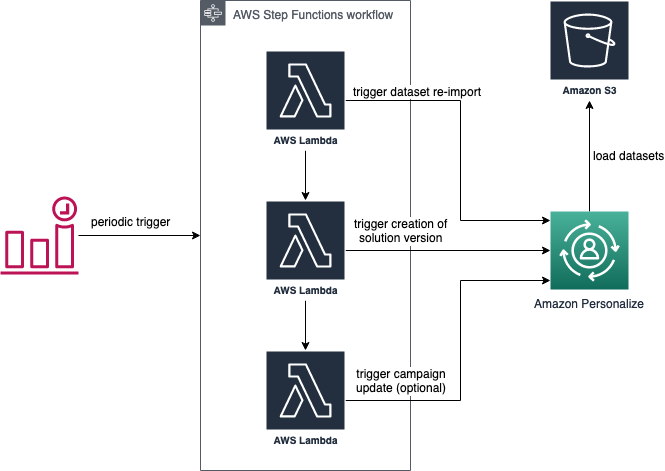

# Automated Personalize Retraining

This sets up a pipeline for periodic re-training of your Personalize model.
Once deployed, the sample will automatically trigger a re-import of your data and re-train the Personalize model (using the same parameters that you initially configured). The cadence of the re-training can be configured in the template (defaults to once per day).

## Deployment

To deploy this sample, you first need to configure a [Personalize model](https://eu-west-1.console.aws.amazon.com/personalize/home?region=eu-west-1). After you have created this, update the required parameters in the [parameters.cfg](parameters.cfg) file before running `make` to deploy the template into your AWS console.

The parameters are

| Parameter Name                  | Description                                                                                                                                | Required |
|---------------------------------|--------------------------------------------------------------------------------------------------------------------------------------------|----------|
| ImportRoleArn                   | ARN of the role that is used to re-import the dataset from S3 (requires read privileges to the S3 bucket containing the dataset).          | Yes      |
| SolutionArn                     | ARN of the Solution that should be used to create a new version for the re-imported dataset.                                               | Yes      |
| UserDatasetArn                  | ARN of the user dataset (in Personalize) that should be re-imported. If left empty, the dataset will not be re-imported.                   | No (*)   |
| S3UserDatasourcePath            | S3 Path to the csv file, the user dataset should be re-imported from. If left empty, the dataset will not be re-imported.                  | No (*)   |
| ItemDatasetArn                  | ARN of the item dataset (in Personalize) that should be re-imported. If left empty, the dataset will not be re-imported.                   | No (*)   |
| S3ItemDatasourcePath            | S3 Path to the csv file, the item dataset should be re-imported from. If left empty, the dataset will not be re-imported.                  | No (*)   |
| UserInteractionDatasetArn       | ARN of the user item interaction dataset (in Personalize) that should be re-imported. If left empty, the dataset will not be re-imported.  | No (*)   |
| S3UserInteractionDatasourcePath | S3 Path to the csv file, the user item interaction dataset should be re-imported from. If left empty, the dataset will not be re-imported. | No (*)   |
| CampaignArn                     | The ARN of the campaign that should be updated (with the retrained solution version). No campaign is updated if this is left empty.        | No       |
| RetrainingRate                  | Rate at which the Personalize should be retrained, defaults to **7 days** if not set.                                                      | No       |

(*) One of the datasources needs to be updated, otherwise, creating a new solution version does not make sense. For the datasource that should be updated, the dataset ARN as well as the S3 path are required.

## Components of this sample

*High level architecture overview of Personalize retraining setup*

## License

This library is licensed under the MIT-0 License. See the [LICENSE](LICENSE) file.

